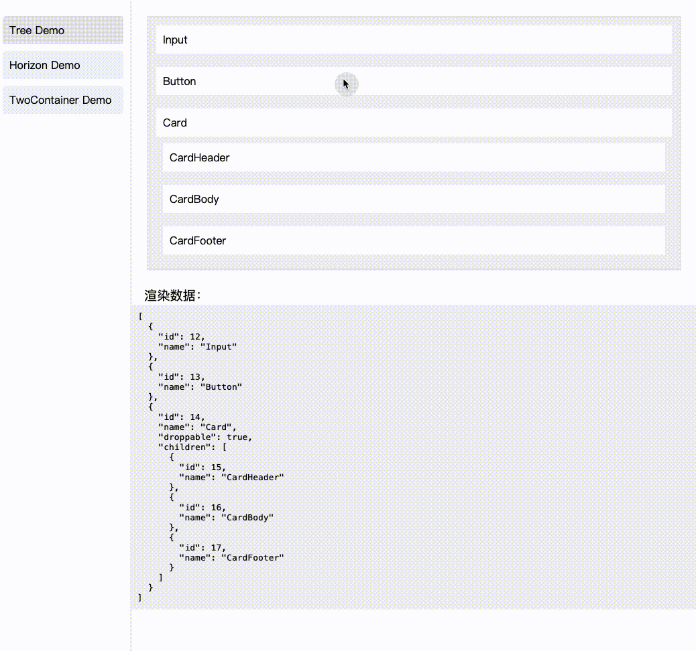

# DTD-Vue 是一个基于数据协议的，适合低代码配置的拖拽vue组件

主要特点：
- 轻量，使用简单
- 自定义程度高

使用：

1. 全局引入

```
import App from './App.vue'
import DragToDrop from 'dtd-vue'

const app = createApp(App)
app.use(DragToDrop)
app.mount('#app')

```

2. 按需引入

```
import { DtdPod } from 'dtd-vue'
import { DragToDrop } from 'dtd-vue'
```

使用案例

```
<script setup lang="ts">
import { ref } from 'vue'

const data = ref([
  {
    id: 12,
    name: 'Input',
  },
  {
    id: 13,
    name: 'Button',
  },
  {
    id: 14,
    name: 'Card',
    droppable: true,
    children: [
      {
        id: 15,
        name: 'CardHeader',
      },
      {
        id: 16,
        name: 'CardBody',
      },
      {
        id: 17,
        name: 'CardFooter',
      },
    ],
  }
])
</script>

<template>
  <div style="padding: 24px;">
    <dtd-pod>
        <div>
          <DragToDrop nodeClass="node-class" class="dtd-root" v-model="data">
              <template #default="{ item }">
                  <div class="dtd-item">{{ item.props?.name }}</div>
              </template>
          </DragToDrop>
        </div>
      <template #ghost="{ item }">
        <div class="ghost-custom">{{ item?.name }}</div>
      </template>
    </dtd-pod>
  </div>
  
  <div class="title">渲染数据：</div>
  <div class="code">
    <pre>{{ data }}</pre>
  </div>
</template>
```

样式参考：

```
html,body,#app {
    height: 100%;
    margin: 0;
}

.title {
    font-size: 1.2em;
    padding: 0 20px;
}

pre {
    margin: 0;
}

.container {
    display: flex;
    justify-content: space-between;
    gap: 10px;
    padding: 20px;
}
.left, .right {
    flex: 1;
}
.ghost-custom {
    background-color: #f0f0f0;
    border: 1px solid #ccc;
    padding: 5px;
    border-radius: 5px;
}

.node-class {
    flex: 1;
    background-color: #f0f0f0;
    padding: 10px;
    /* border: 1px solid #0ac385; */
}

.dtd-root {
    background-color: #ececec;
    padding: 4px;
}

.flex {
    display: flex;
    gap: 10px;
}

.dtd-item {
    padding: 10px;
    background-color: white;
}

.code {
    background-color: #f0f0f0;
    padding: 10px;
}
```

效果：

